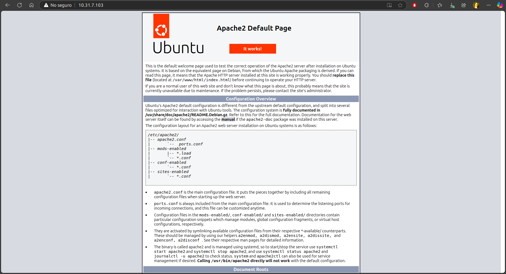

<div align="center">
<h1>PRACTICA 1</h1> 
<h3>Nombre: Antonio López Martínez</h3>  
<h3>Numero Control: 22121322</h3>  
<h3>Maestra: Brenda</h3> 
</img> 
</div>


1. Actualizar los repositorios y paquetes de el sistema operativo

```bash
mutablename96@mutablename96-Nitro-AN515-54:~$ sudo apt update
[sudo] contraseña para mutablename96: 
Des:1 https://packages.microsoft.com/repos/edge stable InRelease [3.590 B]     
Des:2 http://security.ubuntu.com/ubuntu noble-security InRelease [126 kB]      
Des:3 https://packages.microsoft.com/repos/edge stable/main amd64 Packages [15,5 kB]
Des:4 http://security.ubuntu.com/ubuntu noble-security/main amd64 Packages [617 kB]
Des:5 http://security.ubuntu.com/ubuntu noble-security/main Translation-en [118 kB]
Des:6 http://security.ubuntu.com/ubuntu noble-security/main amd64 Components [8.972 B]
Des:7 http://security.ubuntu.com/ubuntu noble-security/restricted amd64 Packages [625 kB]
Des:8 http://security.ubuntu.com/ubuntu noble-security/restricted Translation-en [121 kB]
Des:9 http://security.ubuntu.com/ubuntu noble-security/restricted amd64 Components [208 B]
Des:10 http://security.ubuntu.com/ubuntu noble-security/universe amd64 Packages [803 kB]
Des:11 http://security.ubuntu.com/ubuntu noble-security/universe amd64 Components [51,9 kB]
Des:12 http://security.ubuntu.com/ubuntu noble-security/multiverse amd64 Components [208 B]
Obj:13 http://archive.ubuntu.com/ubuntu noble InRelease                        
Des:14 http://archive.ubuntu.com/ubuntu noble-updates InRelease [126 kB]       
Des:15 http://archive.ubuntu.com/ubuntu noble-backports InRelease [126 kB]     
Des:16 http://archive.ubuntu.com/ubuntu noble-updates/main amd64 Packages [866 kB]
Des:17 http://archive.ubuntu.com/ubuntu noble-updates/main Translation-en [196 kB]
Des:18 http://archive.ubuntu.com/ubuntu noble-updates/main amd64 Components [150 kB]
Des:19 http://archive.ubuntu.com/ubuntu noble-updates/restricted amd64 Packages [654 kB]
Des:20 http://archive.ubuntu.com/ubuntu noble-updates/restricted Translation-en [128 kB]
Des:21 http://archive.ubuntu.com/ubuntu noble-updates/restricted amd64 Components [212 B]
Des:22 http://archive.ubuntu.com/ubuntu noble-updates/universe amd64 Packages [1.014 kB]
Des:23 http://archive.ubuntu.com/ubuntu noble-updates/universe Translation-en [253 kB]
Des:24 http://archive.ubuntu.com/ubuntu noble-updates/universe amd64 Components [363 kB]
Des:25 http://archive.ubuntu.com/ubuntu noble-updates/multiverse amd64 Components [940 B]
Des:26 http://archive.ubuntu.com/ubuntu noble-backports/main amd64 Components [208 B]
Des:27 http://archive.ubuntu.com/ubuntu noble-backports/restricted amd64 Components [212 B]
Des:28 http://archive.ubuntu.com/ubuntu noble-backports/universe amd64 Components [17,6 kB]
Des:29 http://archive.ubuntu.com/ubuntu noble-backports/multiverse amd64 Components [212 B]
Ign:30 https://ppa.launchpadcontent.net/git-core/ppa/ubuntu noble InRelease    
Obj:30 https://ppa.launchpadcontent.net/git-core/ppa/ubuntu noble InRelease    
Descargados 6.387 kB en 33s (191 kB/s)
Leyendo lista de paquetes... Hecho
Creando árbol de dependencias... Hecho
Leyendo la información de estado... Hecho
Se pueden actualizar 192 paquetes. Ejecute «apt list --upgradable» para verlos.

```
Por si acaso no funciono la anterior, otra vez lo hacemos

```bash
mutablename96@mutablename96-Nitro-AN515-54:~$  sudo apt update -y
Obj:1 https://ppa.launchpadcontent.net/git-core/ppa/ubuntu noble InRelease     
Obj:2 https://packages.microsoft.com/repos/edge stable InRelease
Obj:3 http://archive.ubuntu.com/ubuntu noble InRelease                 
Obj:4 http://archive.ubuntu.com/ubuntu noble-updates InRelease         
Obj:5 http://archive.ubuntu.com/ubuntu noble-backports InRelease
Obj:6 http://security.ubuntu.com/ubuntu noble-security InRelease
Leyendo lista de paquetes... Hecho                    
Creando árbol de dependencias... Hecho
Leyendo la información de estado... Hecho
Se pueden actualizar 192 paquetes. Ejecute «apt list --upgradable» para verlos.
```

2. Con esto listo ahora instalamos el servidor web apache y verificamos su status activo

Primero instalamos con `sudo apt install apache2 -y`
```bash
mutablename96@mutablename96-Nitro-AN515-54:~$ sudo apt install apache2 -y
Leyendo lista de paquetes... Hecho
Creando árbol de dependencias... Hecho
Leyendo la información de estado... Hecho
Se instalarán los siguientes paquetes adicionales:
  apache2-bin apache2-data apache2-utils libapr1t64 libaprutil1-dbd-sqlite3
  libaprutil1-ldap libaprutil1t64
Paquetes sugeridos:
  apache2-doc apache2-suexec-pristine | apache2-suexec-custom
Se instalarán los siguientes paquetes NUEVOS:
  apache2 apache2-bin apache2-data apache2-utils libapr1t64
  libaprutil1-dbd-sqlite3 libaprutil1-ldap libaprutil1t64
0 actualizados, 8 nuevos se instalarán, 0 para eliminar y 192 no actualizados.
Se necesita descargar 1.900 kB de archivos.
Se utilizarán 7.455 kB de espacio de disco adicional después de esta operación.
Des:1 http://archive.ubuntu.com/ubuntu noble-updates/main amd64 libapr1t64 amd64 1.7.2-3.1ubuntu0.1 [108 kB]
Des:2 http://archive.ubuntu.com/ubuntu noble/main amd64 libaprutil1t64 amd64 1.6.3-1.1ubuntu7 [91,9 kB]
Des:3 http://archive.ubuntu.com/ubuntu noble/main amd64 libaprutil1-dbd-sqlite3 amd64 1.6.3-1.1ubuntu7 [11,2 kB]
Des:4 http://archive.ubuntu.com/ubuntu noble/main amd64 libaprutil1-ldap amd64 1.6.3-1.1ubuntu7 [9.116 B]
Des:5 http://archive.ubuntu.com/ubuntu noble-updates/main amd64 apache2-bin amd64 2.4.58-1ubuntu8.5 [1.329 kB]
Des:6 http://archive.ubuntu.com/ubuntu noble-updates/main amd64 apache2-data all 2.4.58-1ubuntu8.5 [163 kB]
Des:7 http://archive.ubuntu.com/ubuntu noble-updates/main amd64 apache2-utils amd64 2.4.58-1ubuntu8.5 [97,1 kB]
Des:8 http://archive.ubuntu.com/ubuntu noble-updates/main amd64 apache2 amd64 2.4.58-1ubuntu8.5 [90,2 kB]
Descargados 1.900 kB en 19s (99,4 kB/s)                                        
Seleccionando el paquete libapr1t64:amd64 previamente no seleccionado.
(Leyendo la base de datos ... 205004 ficheros o directorios instalados actualmen
te.)
Preparando para desempaquetar .../0-libapr1t64_1.7.2-3.1ubuntu0.1_amd64.deb ...
Desempaquetando libapr1t64:amd64 (1.7.2-3.1ubuntu0.1) ...
Seleccionando el paquete libaprutil1t64:amd64 previamente no seleccionado.
Preparando para desempaquetar .../1-libaprutil1t64_1.6.3-1.1ubuntu7_amd64.deb ..
.
Desempaquetando libaprutil1t64:amd64 (1.6.3-1.1ubuntu7) ...
Seleccionando el paquete libaprutil1-dbd-sqlite3:amd64 previamente no selecciona
do.
Preparando para desempaquetar .../2-libaprutil1-dbd-sqlite3_1.6.3-1.1ubuntu7_amd
64.deb ...
Desempaquetando libaprutil1-dbd-sqlite3:amd64 (1.6.3-1.1ubuntu7) ...
Seleccionando el paquete libaprutil1-ldap:amd64 previamente no seleccionado.
Preparando para desempaquetar .../3-libaprutil1-ldap_1.6.3-1.1ubuntu7_amd64.deb 
...
Desempaquetando libaprutil1-ldap:amd64 (1.6.3-1.1ubuntu7) ...
Seleccionando el paquete apache2-bin previamente no seleccionado.
Preparando para desempaquetar .../4-apache2-bin_2.4.58-1ubuntu8.5_amd64.deb ...
Desempaquetando apache2-bin (2.4.58-1ubuntu8.5) ...
Seleccionando el paquete apache2-data previamente no seleccionado.
Preparando para desempaquetar .../5-apache2-data_2.4.58-1ubuntu8.5_all.deb ...
Desempaquetando apache2-data (2.4.58-1ubuntu8.5) ...
Seleccionando el paquete apache2-utils previamente no seleccionado.
Preparando para desempaquetar .../6-apache2-utils_2.4.58-1ubuntu8.5_amd64.deb ..
.
Desempaquetando apache2-utils (2.4.58-1ubuntu8.5) ...
Seleccionando el paquete apache2 previamente no seleccionado.
Preparando para desempaquetar .../7-apache2_2.4.58-1ubuntu8.5_amd64.deb ...
Desempaquetando apache2 (2.4.58-1ubuntu8.5) ...
Configurando libapr1t64:amd64 (1.7.2-3.1ubuntu0.1) ...
Configurando apache2-data (2.4.58-1ubuntu8.5) ...
Configurando libaprutil1t64:amd64 (1.6.3-1.1ubuntu7) ...
Configurando libaprutil1-ldap:amd64 (1.6.3-1.1ubuntu7) ...
Configurando libaprutil1-dbd-sqlite3:amd64 (1.6.3-1.1ubuntu7) ...
Configurando apache2-utils (2.4.58-1ubuntu8.5) ...
Configurando apache2-bin (2.4.58-1ubuntu8.5) ...
Configurando apache2 (2.4.58-1ubuntu8.5) ...
Enabling module mpm_event.
Enabling module authz_core.
Enabling module authz_host.
Enabling module authn_core.
Enabling module auth_basic.
Enabling module access_compat.
Enabling module authn_file.
Enabling module authz_user.
Enabling module alias.
Enabling module dir.
Enabling module autoindex.
Enabling module env.
Enabling module mime.
Enabling module negotiation.
Enabling module setenvif.
Enabling module filter.
Enabling module deflate.
Enabling module status.
Enabling module reqtimeout.
Enabling conf charset.
Enabling conf localized-error-pages.
Enabling conf other-vhosts-access-log.
Enabling conf security.
Enabling conf serve-cgi-bin.
Enabling site 000-default.
Created symlink /etc/systemd/system/multi-user.target.wants/apache2.service → /u
sr/lib/systemd/system/apache2.service.
Created symlink /etc/systemd/system/multi-user.target.wants/apache-htcacheclean.
service → /usr/lib/systemd/system/apache-htcacheclean.service.
Procesando disparadores para ufw (0.36.2-6) ...
Procesando disparadores para man-db (2.12.0-4build2) ...
Procesando disparadores para libc-bin (2.39-0ubuntu8.3) ...
mutablename96@mutablename96-Nitro-AN515-54:~$ 

```
despues utilizamos el comando para saber si esta ready`sudo systemctl status apache2`

```bash
mutablename96@mutablename96-Nitro-AN515-54:~$ sudo systemctl status apache2
● apache2.service - The Apache HTTP Server
     Loaded: loaded (/usr/lib/systemd/system/apache2.service; enabled; preset: >
     Active: active (running) since Thu 2025-02-13 13:12:48 CST; 4min 1s ago
       Docs: https://httpd.apache.org/docs/2.4/
   Main PID: 15621 (apache2)
      Tasks: 55 (limit: 18915)
     Memory: 5.8M (peak: 7.5M)
        CPU: 96ms
     CGroup: /system.slice/apache2.service
             ├─15621 /usr/sbin/apache2 -k start
             ├─15623 /usr/sbin/apache2 -k start
             └─15624 /usr/sbin/apache2 -k start

feb 13 13:12:48 mutablename96-Nitro-AN515-54 systemd[1]: Starting apache2.servi>
feb 13 13:12:48 mutablename96-Nitro-AN515-54 apachectl[15620]: AH00558: apache2>
feb 13 13:12:48 mutablename96-Nitro-AN515-54 systemd[1]: Started apache2.servic>
lines 1-16/16 (END)

```

Con esto encendido nomas falta conectarnos a la pagina para ello tenemos que saber la ip que esta usando y usamos el comando `ip a` para ello  
```bash
mutablename96@mutablename96-Nitro-AN515-54:~$ ip a
1: lo: <LOOPBACK,UP,LOWER_UP> mtu 65536 qdisc noqueue state UNKNOWN group default qlen 1000
    link/loopback 00:00:00:00:00:00 brd 00:00:00:00:00:00
    inet 127.0.0.1/8 scope host lo
       valid_lft forever preferred_lft forever
    inet6 ::1/128 scope host noprefixroute 
       valid_lft forever preferred_lft forever
2: enp7s0: <NO-CARRIER,BROADCAST,MULTICAST,UP> mtu 1500 qdisc fq_codel state DOWN group default qlen 1000
    link/ether 08:97:98:89:62:4d brd ff:ff:ff:ff:ff:ff
3: wlp0s20f3: <BROADCAST,MULTICAST,UP,LOWER_UP> mtu 1500 qdisc noqueue state UP group default qlen 1000
    link/ether c8:09:a8:34:72:d6 brd ff:ff:ff:ff:ff:ff
    inet 10.31.7.103/18 brd 10.31.63.255 scope global dynamic noprefixroute wlp0s20f3
       valid_lft 2488sec preferred_lft 2488sec
    inet6 fd11:945b:1bf1:fc26:d8d2:5d2c:b906:99c7/64 scope global temporary dynamic 
       valid_lft 1795sec preferred_lft 1795sec
    inet6 fd11:945b:1bf1:fc26:7a63:cf85:bc4a:6c55/64 scope global dynamic mngtmpaddr noprefixroute 
       valid_lft 1795sec preferred_lft 1795sec
    inet6 fe80::833b:41b:9622:1f5d/64 scope link noprefixroute 
       valid_lft forever preferred_lft forever

```
con esto sabemos que es `10.31.7.103` y solamente nos conectamos y listo

</img> 

Y ya acabamos :D
