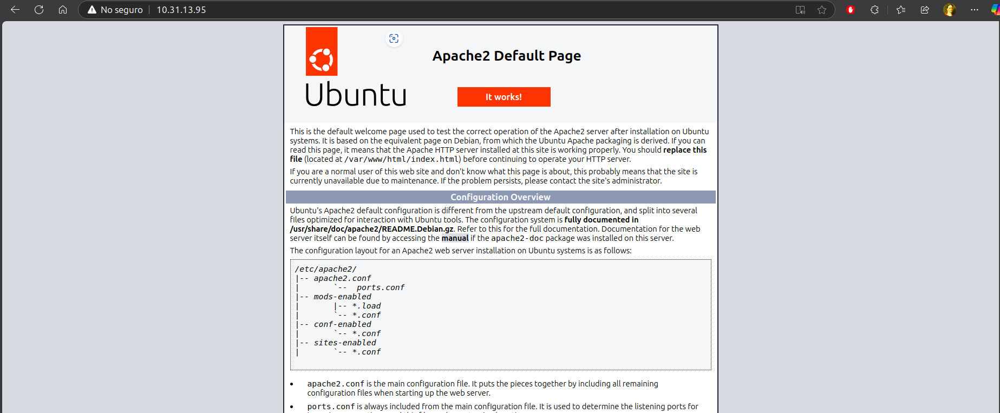

<div align="center">
<h1>PRACTICA 4</h1> 
<h3>Nombre: Antonio López Martínez</h3>  
<h3>Numero Control: 22121322</h3>  
<h3>Maestra: Brenda</h3> 
</img> 
</div>

---


# CONFIGURACIÓN BÁSICA DE UN VPS

Primero tenemo que actualizar los repositorios y paquetes del sistema con los clasicos `sudo apt update`

```bash
mutablename96@mutablename96-Nitro-AN515-54:~$ sudo apt update
[sudo] contraseña para mutablename96: 
Obj:1 http://archive.ubuntu.com/ubuntu noble InRelease
Des:2 http://archive.ubuntu.com/ubuntu noble-updates InRelease [126 kB]        
Des:3 http://archive.ubuntu.com/ubuntu noble-backports InRelease [126 kB]      
Des:4 http://archive.ubuntu.com/ubuntu noble-updates/main amd64 Components [151 kB]
Des:5 http://archive.ubuntu.com/ubuntu noble-updates/restricted amd64 Components [212 B]
Des:6 http://archive.ubuntu.com/ubuntu noble-updates/universe amd64 Components [363 kB]
Des:7 http://archive.ubuntu.com/ubuntu noble-updates/multiverse amd64 Components [940 B]
Des:8 http://archive.ubuntu.com/ubuntu noble-backports/main amd64 Components [208 B]
Des:9 http://archive.ubuntu.com/ubuntu noble-backports/restricted amd64 Components [216 B]
Des:10 http://archive.ubuntu.com/ubuntu noble-backports/universe amd64 Components [17,7 kB]
Des:11 http://archive.ubuntu.com/ubuntu noble-backports/multiverse amd64 Components [212 B]
Obj:12 https://packages.microsoft.com/repos/edge stable InRelease              
Obj:13 https://ppa.launchpadcontent.net/git-core/ppa/ubuntu noble InRelease    
Des:14 http://security.ubuntu.com/ubuntu noble-security InRelease [126 kB]     
Des:15 http://security.ubuntu.com/ubuntu noble-security/main amd64 Components [8.964 B]
Des:16 http://security.ubuntu.com/ubuntu noble-security/restricted amd64 Components [212 B]
Des:17 http://security.ubuntu.com/ubuntu noble-security/universe amd64 Components [52,0 kB]
Des:18 http://security.ubuntu.com/ubuntu noble-security/multiverse amd64 Components [212 B]
Descargados 972 kB en 32s (30,4 kB/s)
Leyendo lista de paquetes... Hecho
Creando árbol de dependencias... Hecho
Leyendo la información de estado... Hecho
Se puede actualizar 1 paquete. Ejecute «apt list --upgradable» para verlo.

```

Con esto hecho prendemos el servidor apache2 y verificamos que funcione accediendo a el servidor mediante la `ip a` y pues si funciona

</img> 

--- 
Con esto podemos instalar una base de datos como MySQL o MariaDB.


## MySQL

```bash
mutablename96@mutablename96-Nitro-AN515-54:~$ sudo apt install mariadb-server
[sudo] contraseña para mutablename96: 
Leyendo lista de paquetes... Hecho
Creando árbol de dependencias... Hecho
Leyendo la información de estado... Hecho
Los paquetes indicados a continuación se instalaron de forma automática y ya no son necesarios.
  libllvm17t64 linux-headers-6.8.0-51 linux-headers-6.8.0-51-generic
  linux-image-6.8.0-51-generic linux-modules-6.8.0-51-generic
  linux-modules-extra-6.8.0-51-generic
  linux-modules-nvidia-550-6.8.0-51-generic
  linux-objects-nvidia-550-6.8.0-51-generic
  linux-signatures-nvidia-6.8.0-51-generic linux-tools-6.8.0-51
  linux-tools-6.8.0-51-generic python3-netifaces
Utilice «sudo apt autoremove» para eliminarlos.
Se instalarán los siguientes paquetes adicionales:
  galera-4 gawk libcgi-fast-perl libcgi-pm-perl libconfig-inifiles-perl
  libdbd-mysql-perl libdbi-perl libfcgi-bin libfcgi-perl libfcgi0t64
  libhtml-template-perl libmariadb3 libmysqlclient21 libsigsegv2
  libterm-readkey-perl liburing2 mariadb-client mariadb-client-core
  mariadb-common mariadb-plugin-provider-bzip2 mariadb-plugin-provider-lz4
  mariadb-plugin-provider-lzma mariadb-plugin-provider-lzo
  mariadb-plugin-provider-snappy mariadb-server-core mysql-common pv socat
Paquetes sugeridos:
  gawk-doc libmldbm-perl libnet-daemon-perl libsql-statement-perl
  libipc-sharedcache-perl mailx mariadb-test doc-base
Se instalarán los siguientes paquetes NUEVOS:
  galera-4 gawk libcgi-fast-perl libcgi-pm-perl libconfig-inifiles-perl
  libdbd-mysql-perl libdbi-perl libfcgi-bin libfcgi-perl libfcgi0t64
  libhtml-template-perl libmariadb3 libmysqlclient21 libsigsegv2
  libterm-readkey-perl liburing2 mariadb-client mariadb-client-core
  mariadb-common mariadb-plugin-provider-bzip2 mariadb-plugin-provider-lz4
  mariadb-plugin-provider-lzma mariadb-plugin-provider-lzo
  mariadb-plugin-provider-snappy mariadb-server mariadb-server-core
  mysql-common pv socat
0 actualizados, 29 nuevos se instalarán, 0 para eliminar y 1 no actualizados.
Se necesita descargar 19,2 MB de archivos.
Se utilizarán 198 MB de espacio de disco adicional después de esta operación.
¿Desea continuar? [S/n] S
Des:1 http://archive.ubuntu.com/ubuntu noble/universe amd64 galera-4 amd64 26.4.16-2build4 [736 kB]
Des:2 http://archive.ubuntu.com/ubuntu noble/main amd64 libsigsegv2 amd64 2.14-1ubuntu2 [15,0 kB]
Des:3 http://archive.ubuntu.com/ubuntu noble/main amd64 gawk amd64 1:5.2.1-2build3 [463 kB]
Des:4 http://archive.ubuntu.com/ubuntu noble/main amd64 mysql-common all 5.8+1.1.0build1 [6.746 B]
Des:5 http://archive.ubuntu.com/ubuntu noble-updates/universe amd64 mariadb-common all 1:10.11.8-0ubuntu0.24.04.1 [27,1 kB]
Des:6 http://archive.ubuntu.com/ubuntu noble/main amd64 libdbi-perl amd64 1.643-4build3 [721 kB]
Des:7 http://archive.ubuntu.com/ubuntu noble/main amd64 libconfig-inifiles-perl all 3.000003-2 [39,4 kB]
Des:8 http://archive.ubuntu.com/ubuntu noble-updates/universe amd64 libmariadb3 amd64 1:10.11.8-0ubuntu0.24.04.1 [188 kB]
Des:9 http://archive.ubuntu.com/ubuntu noble-updates/universe amd64 mariadb-client-core amd64 1:10.11.8-0ubuntu0.24.04.1 [1.010 kB]
Des:10 http://archive.ubuntu.com/ubuntu noble-updates/universe amd64 mariadb-client amd64 1:10.11.8-0ubuntu0.24.04.1 [2.352 kB]
Des:11 http://archive.ubuntu.com/ubuntu noble/main amd64 liburing2 amd64 2.5-1build1 [21,1 kB]
Des:12 http://archive.ubuntu.com/ubuntu noble-updates/universe amd64 mariadb-server-core amd64 1:10.11.8-0ubuntu0.24.04.1 [7.999 kB]
Des:13 http://archive.ubuntu.com/ubuntu noble/main amd64 socat amd64 1.8.0.0-4build3 [374 kB]
Des:14 http://archive.ubuntu.com/ubuntu noble-updates/universe amd64 mariadb-server amd64 1:10.11.8-0ubuntu0.24.04.1 [3.381 kB]
Des:15 http://archive.ubuntu.com/ubuntu noble/main amd64 libcgi-pm-perl all 4.63-1 [185 kB]
Des:16 http://archive.ubuntu.com/ubuntu noble/main amd64 libfcgi0t64 amd64 2.4.2-2.1build1 [26,8 kB]
Des:17 http://archive.ubuntu.com/ubuntu noble/main amd64 libfcgi-perl amd64 0.82+ds-3build2 [21,7 kB]
Des:18 http://archive.ubuntu.com/ubuntu noble/main amd64 libcgi-fast-perl all 1:2.17-1 [10,3 kB]
Des:19 http://archive.ubuntu.com/ubuntu noble-updates/main amd64 libmysqlclient21 amd64 8.0.41-0ubuntu0.24.04.1 [1.254 kB]
Des:20 http://archive.ubuntu.com/ubuntu noble/universe amd64 libdbd-mysql-perl amd64 4.052-1ubuntu3 [85,5 kB]
Des:21 http://archive.ubuntu.com/ubuntu noble/main amd64 libfcgi-bin amd64 2.4.2-2.1build1 [11,2 kB]
Des:22 http://archive.ubuntu.com/ubuntu noble/main amd64 libhtml-template-perl all 2.97-2 [60,2 kB]
Des:23 http://archive.ubuntu.com/ubuntu noble/main amd64 libterm-readkey-perl amd64 2.38-2build4 [23,1 kB]
Des:24 http://archive.ubuntu.com/ubuntu noble-updates/universe amd64 mariadb-plugin-provider-bzip2 amd64 1:10.11.8-0ubuntu0.24.04.1 [13,9 kB]
Des:25 http://archive.ubuntu.com/ubuntu noble-updates/universe amd64 mariadb-plugin-provider-lz4 amd64 1:10.11.8-0ubuntu0.24.04.1 [13,8 kB]
Des:26 http://archive.ubuntu.com/ubuntu noble-updates/universe amd64 mariadb-plugin-provider-lzma amd64 1:10.11.8-0ubuntu0.24.04.1 [13,8 kB]
Des:27 http://archive.ubuntu.com/ubuntu noble-updates/universe amd64 mariadb-plugin-provider-lzo amd64 1:10.11.8-0ubuntu0.24.04.1 [13,8 kB]
Des:28 http://archive.ubuntu.com/ubuntu noble-updates/universe amd64 mariadb-plugin-provider-snappy amd64 1:10.11.8-0ubuntu0.24.04.1 [13,8 kB]
Des:29 http://archive.ubuntu.com/ubuntu noble/main amd64 pv amd64 1.8.5-2build1 [73,9 kB]
Descargados 19,2 MB en 16s (1.170 kB/s)                                        
Preconfigurando paquetes ...
Seleccionando el paquete galera-4 previamente no seleccionado.
(Leyendo la base de datos ... 244970 ficheros o directorios instalados actualmen
te.)
Preparando para desempaquetar .../galera-4_26.4.16-2build4_amd64.deb ...
info: The home dir /nonexistent you specified can't be accessed: No such file or
 directory

info: Seleccionando un UID del rango 100 a 999 ...

info: Añadiendo el usuario del sistema `_galera' (UID 123) ...
info: Añadiendo un nuevo usuario `_galera' (UID 123) con grupo `nogroup' ...
info: Not creating `/nonexistent'.
Desempaquetando galera-4 (26.4.16-2build4) ...
Seleccionando el paquete libsigsegv2:amd64 previamente no seleccionado.
Preparando para desempaquetar .../libsigsegv2_2.14-1ubuntu2_amd64.deb ...
Desempaquetando libsigsegv2:amd64 (2.14-1ubuntu2) ...
Configurando libsigsegv2:amd64 (2.14-1ubuntu2) ...
Seleccionando el paquete gawk previamente no seleccionado.
(Leyendo la base de datos ... 244986 ficheros o directorios instalados actualmen
te.)
Preparando para desempaquetar .../00-gawk_1%3a5.2.1-2build3_amd64.deb ...
Desempaquetando gawk (1:5.2.1-2build3) ...
Seleccionando el paquete mysql-common previamente no seleccionado.
Preparando para desempaquetar .../01-mysql-common_5.8+1.1.0build1_all.deb ...
Desempaquetando mysql-common (5.8+1.1.0build1) ...
Seleccionando el paquete mariadb-common previamente no seleccionado.
Preparando para desempaquetar .../02-mariadb-common_1%3a10.11.8-0ubuntu0.24.04.1

```

Y usamos el comando `Sudo ystemctl status mariadb` para verifiar el proceso y vemos que todo funciona correctamente
```bash
utablename96@mutablename96-Nitro-AN515-54:~$ sudo systemctl status mariadb
● mariadb.service - MariaDB 10.11.8 database server
     Loaded: loaded (/usr/lib/systemd/system/mariadb.service; enabled; preset: >
     Active: active (running) since Mon 2025-02-17 13:19:25 CST; 3min 38s ago
       Docs: man:mariadbd(8)
             https://mariadb.com/kb/en/library/systemd/
   Main PID: 10016 (mariadbd)
     Status: "Taking your SQL requests now..."
      Tasks: 10 (limit: 124246)
     Memory: 78.6M (peak: 82.4M)
        CPU: 778ms
     CGroup: /system.slice/mariadb.service
             └─10016 /usr/sbin/mariadbd

feb 17 13:19:25 mutablename96-Nitro-AN515-54 mariadbd[10016]: 2025-02-17 13:19:>
feb 17 13:19:25 mutablename96-Nitro-AN515-54 mariadbd[10016]: 2025-02-17 13:19:>
feb 17 13:19:25 mutablename96-Nitro-AN515-54 mariadbd[10016]: 2025-02-17 13:19:>
feb 17 13:19:25 mutablename96-Nitro-AN515-54 mariadbd[10016]: 2025-02-17 13:19:>
feb 17 13:19:25 mutablename96-Nitro-AN515-54 mariadbd[10016]: 2025-02-17 13:19:>
feb 17 13:19:25 mutablename96-Nitro-AN515-54 mariadbd[10016]: 2025-02-17 13:19:>
feb 17 13:19:25 mutablename96-Nitro-AN515-54 mariadbd[10016]: Version: '10.11.8>
feb 17 13:19:25 mutablename96-Nitro-AN515-54 systemd[1]: Started mariadb.servic>
feb 17 13:19:25 mutablename96-Nitro-AN515-54 /etc/mysql/debian-start[10034]: Up>
feb 17 13:19:25 mutablename96-Nitro-AN515-54 /etc/mysql/debian-start[10046]: Ch>
lines 1-23...skipping...
● mariadb.service - MariaDB 10.11.8 database server
     Loaded: loaded (/usr/lib/systemd/system/mariadb.service; enabled; preset: enabled)
     Active: active (running) since Mon 2025-02-17 13:19:25 CST; 3min 38s ago
       Docs: man:mariadbd(8)
             https://mariadb.com/kb/en/library/systemd/
   Main PID: 10016 (mariadbd)
     Status: "Taking your SQL requests now..."
      Tasks: 10 (limit: 124246)
     Memory: 78.6M (peak: 82.4M)
        CPU: 778ms
     CGroup: /system.slice/mariadb.service
             └─10016 /usr/sbin/mariadbd

```

Ahora Crearemos una Base de Datos y para ello accedemos a la consola de mariaDB para crearla. mediante el comando `sudo mysql
`

```bash
MariaDB [(none)]> CREATE DATABASE prueba_vps;
Query OK, 1 row affected (0,000 sec)


MariaDB [(none)]> SHOW databases;
+--------------------+
| Database           |
+--------------------+
| information_schema |
| mysql              |
| performance_schema |
| prueba_vps         |
| sys                |
+--------------------+
5 rows in set (0,001 sec)


```
Asi teniendo la BD lista y salimos por medio del comando `exit`


## SSH

Ahora instalamos el SSH por medio del servidor OpenSSH para supono acceder remotamente al server.Solo la profe sabe pa que lo instalamos


```bash
mutablename96@mutablename96-Nitro-AN515-54:~$ sudo apt install openssh-server
Leyendo lista de paquetes... Hecho
Creando árbol de dependencias... Hecho
Leyendo la información de estado... Hecho
Los paquetes indicados a continuación se instalaron de forma automática y ya no son necesarios.
  libllvm17t64 linux-headers-6.8.0-51 linux-headers-6.8.0-51-generic linux-image-6.8.0-51-generic linux-modules-6.8.0-51-generic linux-modules-extra-6.8.0-51-generic
  linux-modules-nvidia-550-6.8.0-51-generic linux-objects-nvidia-550-6.8.0-51-generic linux-signatures-nvidia-6.8.0-51-generic linux-tools-6.8.0-51 linux-tools-6.8.0-51-generic
  python3-netifaces
Utilice «sudo apt autoremove» para eliminarlos.
Se instalarán los siguientes paquetes adicionales:
  ncurses-term openssh-sftp-server ssh-import-id
Paquetes sugeridos:
  molly-guard monkeysphere ssh-askpass
Se instalarán los siguientes paquetes NUEVOS:
  ncurses-term openssh-server openssh-sftp-server ssh-import-id
0 actualizados, 4 nuevos se instalarán, 0 para eliminar y 1 no actualizados.
Se necesita descargar 832 kB de archivos.
Se utilizarán 6.747 kB de espacio de disco adicional después de esta operación.
¿Desea continuar? [S/n] S
Des:1 http://archive.ubuntu.com/ubuntu noble-updates/main amd64 openssh-sftp-server amd64 1:9.6p1-3ubuntu13.5 [37,3 kB]
Des:2 http://archive.ubuntu.com/ubuntu noble-updates/main amd64 openssh-server amd64 1:9.6p1-3ubuntu13.5 [509 kB]
Des:3 http://archive.ubuntu.com/ubuntu noble/main amd64 ncurses-term all 6.4+20240113-1ubuntu2 [275 kB]
Des:4 http://archive.ubuntu.com/ubuntu noble-updates/main amd64 ssh-import-id all 5.11-0ubuntu2.24.04.1 [10,1 kB]
Descargados 832 kB en 4s (224 kB/s)       
Preconfigurando paquetes ...

```

y con el comando `sudo systemctl status ssh` verificamos si jala

```bash
mutablename96@mutablename96-Nitro-AN515-54:~$ sudo systemctl status ssh
○ ssh.service - OpenBSD Secure Shell server
     Loaded: loaded (/usr/lib/systemd/system/ssh.service; disabled; preset: enabled)
     Active: inactive (dead)
TriggeredBy: ● ssh.socket
       Docs: man:sshd(8)
             man:sshd_config(5)
mutablename96@mutablename96-Nitro-AN515-54:~$ 

```

y nos conectamos con el siguiente comando `ssh mutablename96@10.31.13.95` y ya se acabo.
```bash
mutablename96@mutablename96-Nitro-AN515-54:~$ ssh mutablename96@10.31.13.95
The authenticity of host '10.31.13.95 (10.31.13.95)' can't be established.
ED25519 key fingerprint is SHA256:BJYaecSUePdKuysVDv88xOzje8BoATk1ObflpQCJADY.
This key is not known by any other names.
Are you sure you want to continue connecting (yes/no/[fingerprint])? yes
Warning: Permanently added '10.31.13.95' (ED25519) to the list of known hosts.
mutablename96@10.31.13.95's password: 
Welcome to Ubuntu 24.04.2 LTS (GNU/Linux 6.11.0-17-generic x86_64)

 * Documentation:  https://help.ubuntu.com
 * Management:     https://landscape.canonical.com
 * Support:        https://ubuntu.com/pro

El mantenimiento de seguridad expandido para Applications está desactivado

Se puede aplicar 1 actualización de forma inmediata.
Para ver estas actualizaciones adicionales, ejecute: apt list --upgradable

8 actualizaciones de seguridad adicionales se pueden aplicar con ESM Apps.
Aprenda más sobre cómo activar el servicio ESM Apps at https://ubuntu.com/esm


The programs included with the Ubuntu system are free software;
the exact distribution terms for each program are described in the
individual files in /usr/share/doc/*/copyright.

Ubuntu comes with ABSOLUTELY NO WARRANTY, to the extent permitted by
applicable law.

```
